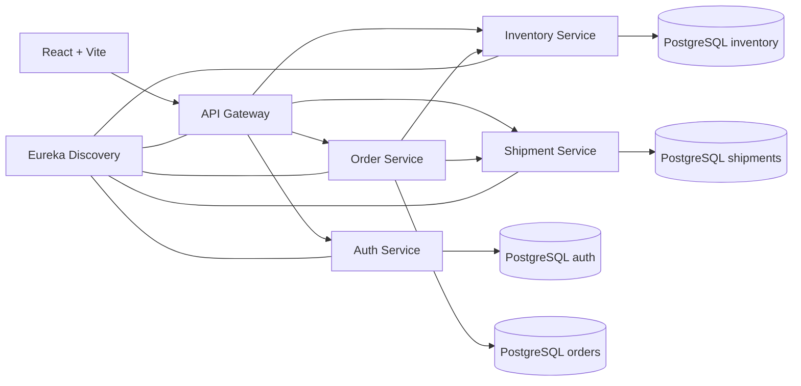

# SmartLogix

Plataforma full stack de ecommerce y operacion logistica desarrollada como
proyecto de portafolio. Reune una tienda para clientes y un panel interno para
administrar inventario, bodegas, pedidos, envios, usuarios y descuentos.

Repositorio: [damvillanueva/ProyectoEcommerce1](https://github.com/damvillanueva/ProyectoEcommerce1)

## Funcionalidades

### Tienda ecommerce

- Catalogo publico con busqueda, categorias, detalle, resenas y preguntas.
- Carrito independiente y checkout autenticado para clientes.
- Despacho o retiro, cotizacion de envio y codigos de descuento.
- Pago demostrativo, confirmacion de compra y seguimiento del pedido.
- Cuenta de cliente con perfil, direcciones, favoritos e historial de compras.
- Cancelacion con liberacion de stock y reembolso simulado.
- Preferencias de accesibilidad persistentes en tienda y panel interno.

### Operacion interna

- Autenticacion JWT y autorizacion por roles en frontend y backend.
- Dashboard con indicadores de inventario y productos criticos.
- Inventario con imagenes, categorias, stock, reservas y reposicion.
- Historial, auditoria, exportacion CSV/Excel y movimientos manuales.
- Bodegas visuales, ubicaciones fisicas, traslados y explorador 3D con Three.js.
- Gestion de pedidos, envios, usuarios y descuentos.
- Codigos QR por SKU y localizacion por nombre, codigo o ubicacion.

## Arquitectura



El backend usa una base y un usuario PostgreSQL independiente por servicio.
Flyway controla las migraciones y Docker Compose levanta la plataforma completa.

## Tecnologias

- Frontend: React 19, Vite 8, React Router, Tailwind CSS y Three.js.
- Backend: Java 17, Spring Boot 3.3, Spring Cloud Gateway y Eureka.
- Datos: PostgreSQL 16, Flyway y H2 solo para pruebas automatizadas.
- Operacion: Docker Compose, health checks y scripts de backup/restore.
- Observabilidad: Prometheus, Grafana, Zipkin, metricas de negocio y correlacion de solicitudes.

## Ejecucion local

Requisitos: Docker Desktop, Node.js 20 o superior y Git.

```powershell
git clone https://github.com/damvillanueva/ProyectoEcommerce1.git
cd ProyectoEcommerce1\smartlogix-back
Copy-Item .env.example .env
```

Reemplace todos los valores `REEMPLAZAR_*` de `smartlogix-back/.env` y levante
el backend:

```powershell
docker compose up --build -d
docker compose ps
```

En otra terminal, levante el frontend:

```powershell
cd smartlogix-front
Copy-Item .env.example .env
npm install
npm run dev
```

- Tienda: `http://localhost:5174/shop`
- Panel interno: `http://localhost:5174/`
- API Gateway: `http://localhost:8080`
- Eureka: `http://localhost:8761`
- Grafana: `http://127.0.0.1:3000`
- Prometheus: `http://127.0.0.1:9090`
- Zipkin: `http://127.0.0.1:9411`

Los usuarios semilla son `admin`, `usuario`, `bodeguero` y `cliente`. Sus
contrasenas se configuran localmente en `.env`; el repositorio no contiene
credenciales funcionales.

## Seguridad

- Los permisos se validan en backend; cambiar el rol desde las herramientas del
  navegador no concede privilegios.
- JWT, credenciales semilla, CORS y claves de base de datos se exigen por entorno.
- Los servicios internos no publican sus puertos al host y usan privilegio minimo.
- PostgreSQL se enlaza a `127.0.0.1` y cada servicio usa credenciales separadas.
- Los respaldos incluyen manifiesto, tamano y hash SHA-256 antes de restaurar.
- Los paneles de monitoreo se enlazan solo a `127.0.0.1` y Grafana es de solo lectura.

La matriz de controles y referencias chilenas/internacionales esta en
[NORMATIVA_Y_ESTANDARES.md](NORMATIVA_Y_ESTANDARES.md). No representa una
certificacion ni reemplaza una revision legal o de seguridad independiente.

## Calidad

```powershell
cd smartlogix-back
.\mvnw.cmd -pl auth-service,inventory-service,order-service,shipment-service -am test

cd ..\smartlogix-front
npm run lint
npm run build
npm run audit:accessibility
```

## Documentacion

- [Backend y API](smartlogix-back/README.md)
- [Backup y restauracion](smartlogix-back/docs/BACKUP_RESTORE.md)
- [Metricas, trazas y logs](smartlogix-back/docs/OBSERVABILITY.md)
- [Roadmap del producto](ROADMAP_PLANTILLA_ECOMMERCE.md)
- [Normativa y estandares](NORMATIVA_Y_ESTANDARES.md)
- [Evolucion tecnica](MEJORAS_PERSONALES.md)

## Alcance actual

SmartLogix es una demostracion funcional de arquitectura y producto. Los pagos
son simulados, las imagenes subidas se almacenan como data URL y el comprobante
de compra no es un documento tributario del SII. Antes de operar con clientes
reales faltan integraciones de pago, facturacion, correo, almacenamiento de
archivos, alertas operativas, despliegue productivo y una auditoria de seguridad formal.

## Autor

[Damian Villanueva](https://github.com/damvillanueva)
